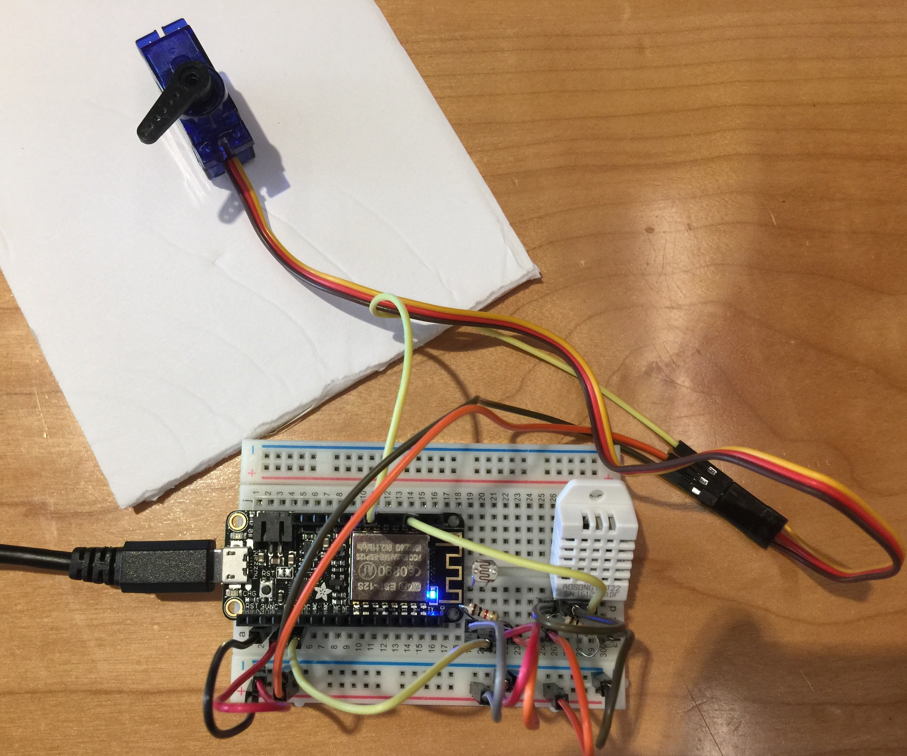

# IOT Hackathon 2018 Group Project (Team 7)

#### Blind Light Indicator, Mar 24 2018

##### Usage -

* To measure light and temperature, to close window blinds automatically to conserve energy
* to make living comfortable
* saves money
* assist people with light sensitivity
* useful in situations for people with disabilities who cannot physically move blinds

#### By Ann Kasper, Eric Chunn, Holly Wilkalis, Kelly Ogilvie, Ryan Gergioff, Shyamal Punekar

## Description

_An application that controls window blinds to open or close in relation to light and temperature to save energy_

## Setup/Installation Requirements
* Open Arduino IDE
* Upload to launch the application
* Use the application to see the

# Setup
  https://github.com/WWCodeHackthon2018-team7/blind-light-indicator

# Screenshots
## The Breadboard layout

# Support and contact details

  Please feel free to contact shyamal.punekar@gmail.com, kellyeogilvie@gmail.com if you have any questions, issues, concerns, comments or suggestions.
# Known Bugs
_There are no known bugs at this time!_

## Technologies Used

* Arduino IDE
* fritzing tool
* Parts-
  * 1 * Breadboard
  * 1 * Adafruit Feather HUZZAH ESP8266
  * 1 * Photoresistor
  * 1 * 10K resistor
  * 1 * DHT22 temperature-humidity sensor
  * 1 * Micro Servo Motor
  * Messaging framework for Internet of Things http://dweet.io/

### License

Copyright &copy; 2018 Kelly Ogilvie, Shyamal Punekar, Holly Wilkalis, Ann Kasper, Ryan Gergioff, Eric Chunn