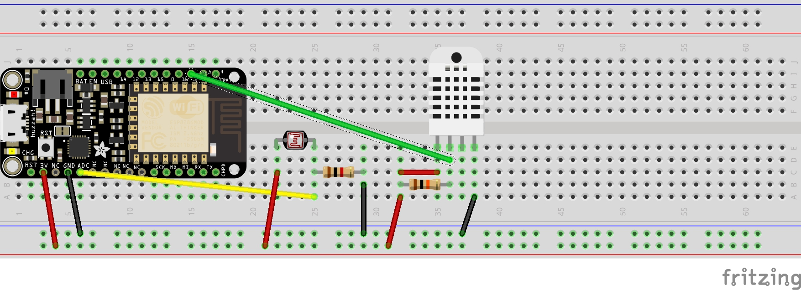
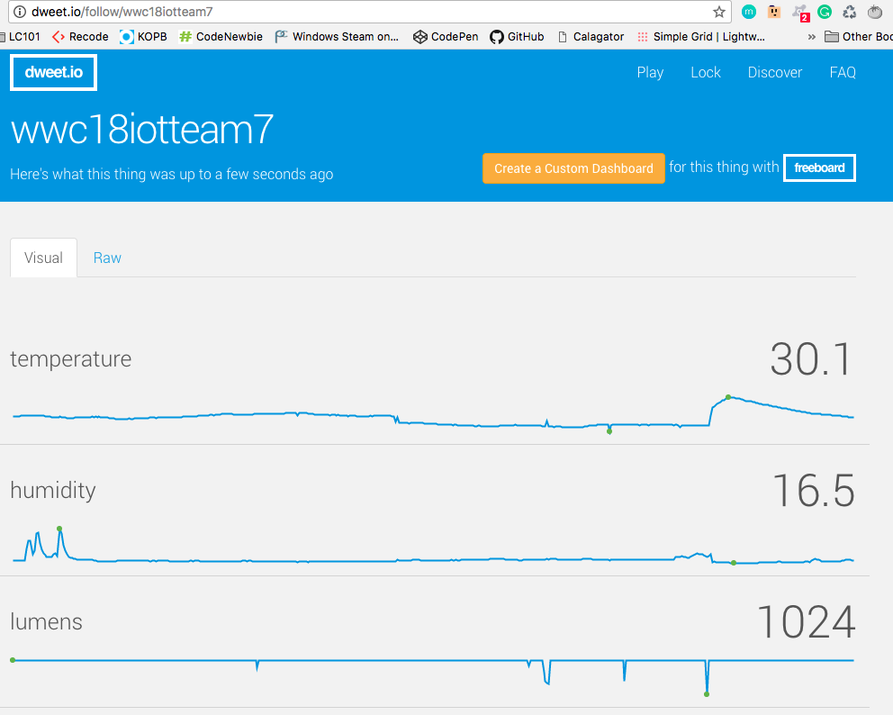

# IOT Hackathon 2018 Group Project (Team 7)

#### Blindz Minder, Mar 24-25 2018

##### Usage -

* close window blinds automatically to conserve energy
* saves money on energy bills
* assist people with light sensitivity
* useful in situations for people with disabilities who cannot physically move blinds

#### By Ann Kasper, Eric Chunn, Holly Wilkalis, Kelly Ogilvie, Ryan Gergioff, Shyamal Punekar

## Description

_An Arduino device that closes window blinds automatically, based on ambient light and temperature input in order to save energy in the home._

## Setup/Installation Requirements

* Connect the components as shown below screenshot1.jpg.
* Connect Adafruit Feather HUZZAH ESP8266 to Computer via USB.
* Open Arduino IDE
* Install libraries -
  * Arduino Uno WiFi Dev Ed Library by Arduino Version 0.0.3
  * SHsT sensory library by Adafruit Version 1.2.3
  * DHT sensory library for ESPx by beegee_tokyo Version 1.0.6
* Set com port (IDE -> Tools -> port)
* Set the baud rate to 11500 (IDE -> Tools -> Upload speed: 115200)
* Open 'light-indicator.ino' file.
* Enter your wi-fi credentials in 'light-indicator.ino' file.
* Enter unique name for your device in 'light-indicator.ino' file.
* Upload to launch the application.
* Use the http://dweet.io/ to see output.

# Setup
  https://github.com/WWCodeHackthon2018-team7/blind-light-indicator

# Screenshots
## The Breadboard layout

# Support and contact details

  Please feel free to contact shyamal.punekar@gmail.com, kellyeogilvie@gmail.com, holly.wilkalis@gmail.com, pretcoregon@yahoo.com, doughmatrix@protonmail.com, ericandrewchunn@gmail.com, if you have any questions, issues, concerns, comments or suggestions.

# Known Bugs
  _Vulnerable http client!_

# Future Implementations
  __

## Technologies Used

* Arduino IDE
* fritzing tool
* Parts-
  * 1 * Breadboard
  * 1 * Adafruit Feather HUZZAH ESP8266
  * 1 * Photoresistor
  * 1 * 10k resistor
  * 1 * 1k resistor
  * 1 * DHT22 temperature-humidity sensor
  * 1 * Micro Servo Motor
  * Messaging framework for Internet of Things http://dweet.io/

### License

Copyright &copy; 2018 Kelly Ogilvie, Shyamal Punekar, Holly Wilkalis, Ann Kasper, Ryan Gergioff, Eric Chunn
